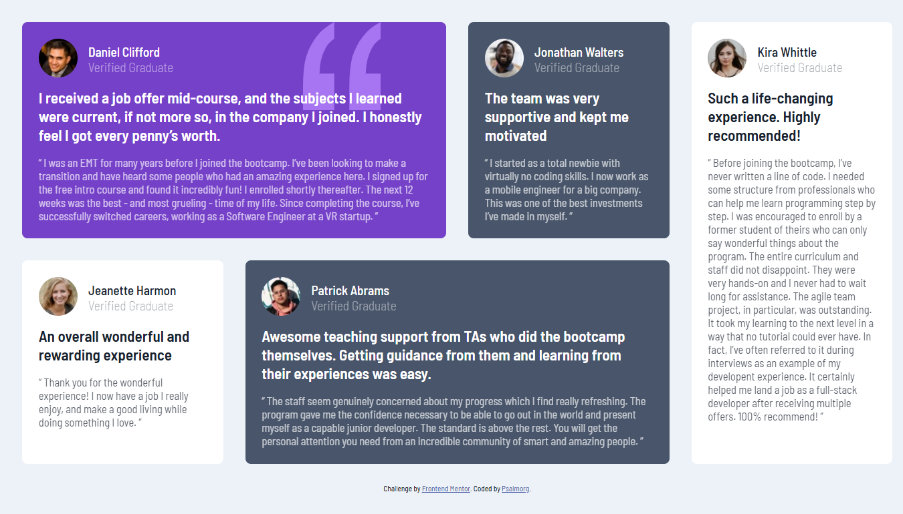
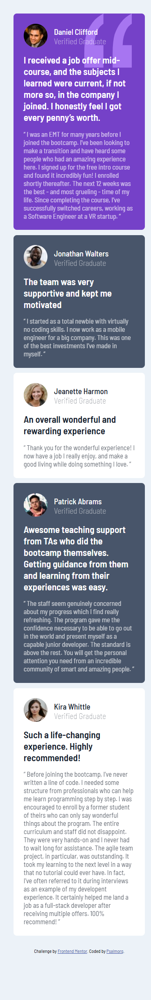

# Frontend Mentor - Testimonials grid section solution

This is a solution to the [Testimonials grid section challenge on Frontend Mentor](https://www.frontendmentor.io/challenges/testimonials-grid-section-Nnw6J7Un7). Frontend Mentor challenges help you improve your coding skills by building realistic projects. 

## Table of contents

- [Overview](#overview)
  - [The challenge](#the-challenge)
  - [Screenshot](#screenshot)
  - [Links](#links)
- [My process](#my-process)
  - [Built with](#built-with)
  - [What I learned](#what-i-learned)
  - [Continued development](#continued-development)
- [Author](#author)
- [Acknowledgments](#acknowledgments)

**Note: Delete this note and update the table of contents based on what sections you keep.**

## Overview

### The challenge

Users should be able to:

- View the optimal layout for the site depending on their device's screen size

### Screenshot

- Desktop View


- Mobile View



### Links

- Solution URL: [Solution URl](https://github.com/Psalmorg/Testimonials-grid)
- Live Site URL: [Live URL](https://psalmorg.github.io/Testimonials-grid)

## My process

### Built with

- Semantic HTML5 markup
- CSS custom properties
- Flexbox
- CSS Grid


### What I learned

This being my second time on working on ```grid``` related project, i have more understand of ```grid``` especially ```grid-template```

```css
.main {
  grid-template-column:repeat(4,1fr);
}
```


### Continued development

- Grid and its properties
- Pseudo class: i think the pseudo class can be use for ```h4, h3 and p``` instead onf nestiing them.  
```css
.kira {
    background-color: var(--White);
    grid-column: 4;
    grid-row: 1/3;
    h3,h4,p {
        color: var(--Very-dark-blackish-blue);
    } 
}

.jeanette {
    background-color: var(--White);
    grid-row: 2;
    h3,h4,p {
        color: var(--Very-dark-blackish-blue);
    }   
}
```


## Author

- Frontend Mentor - [@Psalmorg](https://www.frontendmentor.io/profile/psalmorg)


## Acknowledgments
### During the course of this project, i look at [@xStephx](https://www.frontendmentor.io/solutions/solution-testimonials-grid-section-A_WYM7MYsc) submited work to perfected mine.


